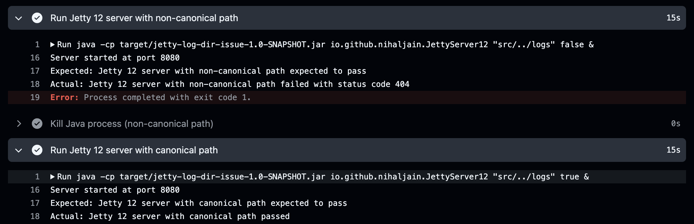

# Jetty Logs Directory Bug Report

This project demonstrates a bug in Jetty 12 where setting the base resource to a path containing `..` results in a 404 error, whereas the same setup works in Jetty 9.

## Project Structure

- `src/main/java/com/example/JettyServer9.java`: Jetty 9 server setup
- `src/main/java/com/example/JettyServer12.java`: Jetty 12 + EE8 server setup
- `src/main/java/com/example/Util.java`: Utility class to get logs directory
- `pom.xml`: Maven configuration file with Jetty 9 and Jetty 12 profiles

## Diff between Jetty 9 and Jetty 12 code

Code changes between Jetty 9 and Jetty 12 are minimal. Both the Jetty 9 and Jetty 12 servers serve the contents of the logs directory at the `/logs` endpoint and have similar implementations.

```sh
diff src/main/java/io/github/nihaljain/JettyServer9.java src/main/java/io/github/nihaljain/JettyServer12.java
8,9c8,9
< import org.eclipse.jetty.servlet.ServletContextHandler;
< import org.eclipse.jetty.servlet.ServletHolder;
---
> import org.eclipse.jetty.ee8.servlet.ServletContextHandler;
> import org.eclipse.jetty.ee8.servlet.ServletHolder;
11,12c11,12
< import org.eclipse.jetty.server.handler.HandlerCollection;
< import org.eclipse.jetty.servlet.DefaultServlet;
---
> import org.eclipse.jetty.server.Handler;
> import org.eclipse.jetty.ee8.servlet.DefaultServlet;
14,15c14,15
< public class JettyServer9 {
<   private static final Logger logger = LoggerFactory.getLogger(JettyServer9.class);
---
> public class JettyServer12 {
>   private static final Logger logger = LoggerFactory.getLogger(JettyServer12.class);
30c30
<     HandlerCollection handlerCollection = new HandlerCollection();
---
>     Handler.Sequence handlerCollection = new Handler.Sequence();
  ```

## Issue

The issue is a discrepancy between Jetty 9 and Jetty 12 when setting the base resource to a path containing `..`.

* In Jetty 9, the server correctly resolves the path and serves the contents of the logs directory. 
* However, in Jetty 12, the same setup results in a 404 error, indicating that the path resolution fails.

This behavior is demonstrated by running the provided Java server code with both Jetty versions and accessing the /logs endpoint.

## Steps to Reproduce

### Setup (common for Jetty 9 and Jetty 12)

* Create a logs directory in the project root.
   - `mkdir logs`
* Ensure that the logs directory exists and is accessible.
* The `..` in the path should be resolved correctly in both Jetty 9 and Jetty 12.

### Running with Jetty 9

1. Navigate to the project directory.
2. Compile the project:
   ```sh
   mvn clean install -Pjetty9
   ```
3. Run the Jetty 9 server:
   ```sh
   java -cp target/jetty-log-dir-issue-1.0-SNAPSHOT.jar io.github.nihaljain.JettyServer9 "src/../logs" false
   ```
   Replace /path/to/logs with the actual path to your logs directory.
4. Open the following URL in a browser: http://localhost:8080/logs
   - You should see the contents of the logs directory.
5. Stop the Jetty 9 server.
6. Rerun the Jetty 9 server with the following command:
   ```sh
   java -cp target/jetty-log-dir-issue-1.0-SNAPSHOT.jar io.github.nihaljain.JettyServer9 "src/../logs" true
   ```
7. Open the following URL in a browser: http://localhost:8080/logs 
   - You should see the contents of the logs directory.
8. Stop the Jetty 9 server.
9. Clean the project:
   ```sh
   mvn clean
   ```


### Running with Jetty 12
1. Navigate to the project directory.
2. Compile the project:
   ```sh
   mvn clean install -Pjetty12
3. Run the Jetty 12 server:
   ```sh
   java -cp target/jetty-log-dir-issue-1.0-SNAPSHOT.jar io.github.nihaljain.JettyServer12 "src/../logs" false 
   ```
   Replace /path/to/logs with the actual path to your logs directory.
4. Open the following URL in a browser: http://localhost:8080/logs
   - You will see a 404 error with Jetty 12 + EE8
5. Stop the Jetty 12 server.
6. Now rerun the Jetty 12 server with the following command:
   ```sh
   java -cp target/jetty-log-dir-issue-1.0-SNAPSHOT.jar io.github.nihaljain.JettyServer12 "src/../logs" true
   ```
7. Open the following URL in a browser: http://localhost:8080/logs
   - You should see the contents of the logs directory.
8. Stop the Jetty 12 server.
9. Clean the project:
   ```sh
   mvn clean
   ```

## Actual Behavior

* Jetty 9: The server starts successfully, and the logs directory is accessible.
* Jetty 12: The server starts successfully, but accessing the logs directory results in a 404 error if the path contains `..`.

## Expected Behavior

* Jetty 9 and Jetty 12 should behave the same way when accessing the logs directory.

## Screenshots

* For Jetty 9:

Refer https://github.com/NihalJain/jetty_log_dir_issue/actions/runs/14220759214/job/39847924316

* While, for Jetty 12:

Refer https://github.com/NihalJain/jetty_log_dir_issue/actions/runs/14220759206/job/39847924335

## Environment
* Jetty version: 9.x and 12.x
* Java version: 17
* Operating system: macOS / CentOS 8
* Steps to reproduce (as described above)